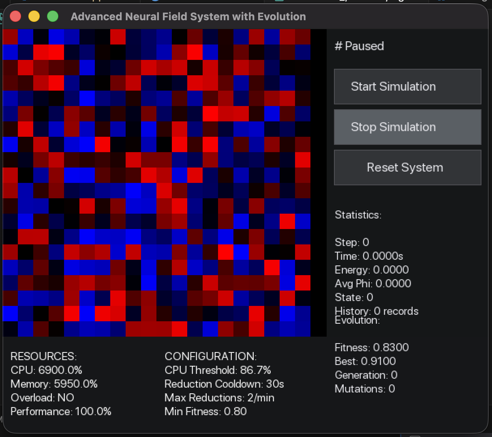

# Neural Field Dynamics Simulator v2.0 - "Evolving Intelligence"

A sophisticated C++ simulation framework for studying neural field dynamics with applications in biomedical research and computational neuroscience.

### 🧠 Overview

A revolutionary C++ simulation framework that implements self-evolving neural field dynamics with real-time code optimization and adaptive learning capabilities. This system represents a significant breakthrough in computational neuroscience by introducing autonomous code evolution based on performance metrics.

### 🎯 What's New in v2.0 - "Evolving Intelligence"
Revolutionary Self-Evolution Capabilities
The system now features autonomous code evolution that optimizes itself based on three key performance metrics:

- Code Efficiency Score: Evaluates code size and complexity

- Performance Score: Measures computational efficiency and speed

- Energy Score: Tracks energy consumption and optimization

### EvolutionModule - The Brain Behind the Evolution
Real-time Fitness Evaluation: Continuously assesses system performance
Adaptive Mutation System: Proposes and applies intelligent code modifications
Automated Backups: Creates versioned backups before each evolution cycle
Stasis Management: Enters low-power mode during resource constraints

### ResourceMonitor - Intelligent Resource Management
Adaptive Thresholds: Self-adjusting CPU (85%) and memory (90%) limits
Debounce Protection: Prevents false overload triggers
Performance Scaling: Dynamically adjusts computational intensity

### ImmutableCore - Secure Evolution Foundation
Permission System: Controls mutation and optimization requests
Safety Protocols: Ensures stable evolution cycles
Rollback Mechanisms: Automatic recovery from failed optimizations

### 🤝 Contributing
We welcome contributions! Please see our Contributing Guidelines for details.

Branch Structure:
main - Stable production releases
develop - Development integration branch
feature/ - New features
bugfix/ - Bug fixes
research/ - Experimental research branches

### History
v1.0: Basic neural field simulation with static modules - in old folder
v2.0: Self-evolving system with autonomous optimization - deleted
v3.0+: External code optimization and AI-enhanced evolution ← You are here

 Whats new in v3
Intelligent Resource Awareness
Adaptive Load Balancing: Automatically adjusts to system capabilities
Smart Throttling: Prevents excessive evolution cycles
Context-Aware Optimization: Tailors improvements to current performance

Evolutionary Metrics System
Multi-objective Optimization: Balances code size, speed, and energy
Degradation Detection: Identifies and rolls back unsuccessful mutations
Progressive Improvement: Builds upon successful evolutionary steps

### Current Capabilities
✅ Real-time code optimization
✅ Autonomous performance tuning
✅ Resource-aware evolution
✅ Safe rollback mechanisms
✅ Multi-metric fitness evaluation
### Real-time Monitoring Dashboard
Resource Utilization: Live CPU/memory tracking
Evolution Progress: Fitness scores and generation tracking
System Status: Stasis mode and optimization state

===================================================================

### 📜 License
This project is licensed under the GPL v3 License - see the [GPL v3 License](LICENSE). file for details.

For commercial licensing inquiries, please contact the maintainer.

### 📚 References
Wilson, H. R., & Cowan, J. D. (1972). Excitatory and inhibitory interactions in localized populations of model neurons.

Ermentrout, G. B., & Cowan, J. D. (1979). A mathematical theory of visual hallucination patterns.

Coombes, S. (2005). Waves, bumps, and patterns in neural field theories.

### Contact
For questions and collaborations:

GitHub Issues: [Create a new issue](https://github.com/khamit/cpp_ai_mary/issues/new?title=Bug+report&body=Please+describe+the+bug+steps&labels=bug)

Email: gercules@gmail.com, khamit@combi.kz

Telegram: @lordekz

