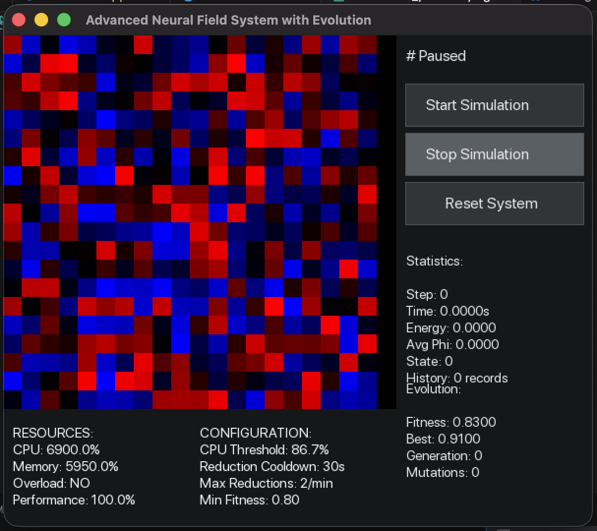

# Neural Field System v2.0 - "Evolving Intelligence"

A sophisticated C++ simulation framework featuring a self-evolving neural field with **1024 neurons**, adaptive memory management, and real-time code optimization capabilities.



# ⚠️ Important Notice for Using the Project

**Mary AI Core** is a local artificial intelligence core designed to run entirely on the user's device. Below are the key points regarding rights and responsibilities:  

1. **Local Use**  
   - The model **does not connect to the internet** and **does not transmit data anywhere**.  
   - All operations are performed entirely on the user's device.  

2. **Data Handling**  
   - The core **does not collect, store, or transmit personal data** in its original form.  
   - Any data entered by the user for training or adaptation **remains fully under the user's control**.  

3. **Adaptation and Modifications**  
   - Users may **modify the core or extend it with new data or features**.  
   - Any changes made by the user **are not the responsibility of the code author**.  
   - The project author is responsible **only for the functionality and behavior of the code published in this repository**.  

4. **Responsibility and Risks**  
   - The author is **not liable** for:  
     - any consequences of using modified versions of the core,  
     - the user's handling of local data,  
     - the behavior of the system after user modifications.  
   - The user **bears full responsibility** for using, adapting, or distributing modified versions of the core.  

5. **Transparency and Ethics**  
   - The model is intended to **assist the user** and should not be used for critical decisions affecting health, finances, or safety of others.  
   - Any outputs or recommendations from the model **are results of the local program and should not be considered official advice**.  

6. **Compliance with Laws and Standards**  
   - The core aligns with low-risk AI system requirements:  
     - local data processing,  
     - no automatic collection of personal data,  
     - transparent usage.  
   - Any user modifications or extensions **are outside the author's control**, and compliance with applicable laws is the user's responsibility.  

💡 **Summary:**  
The author is responsible **only for the code published in this repository**. The user fully controls local use, training, and modifications of the model. Any actions after modifications are **entirely the user's responsibility**.

## (!) Key Features

### Core Neural Engine
- **1024 neurons** (32x32 grid) for complex pattern formation
- Symplectic integration for energy conservation
- Real-time field visualization with SFML
- Configurable physical parameters (mass, coupling, damping)

### (!) MemoryModule - Intelligent Experience Storage
- **Priority-based memory** with automatic cleanup
- 64-dimensional feature vectors from neural activity
- Cosine similarity search for relevant past experiences
- Automatic decay (forgetting) mechanism: `utility *= 0.995`
- Persistent storage with checkpoint system
- Memory limits: configurable up to 10,000 records

### (!) EvolutionModule - Self-Optimizing Code
Real-time fitness evaluation based on three metrics:
- **Code Efficiency Score**: Evaluates code size and complexity
- **Performance Score**: Measures computational efficiency
- **Energy Score**: Tracks system energy consumption

Features:
- Autonomous code mutation proposals
- Fitness-based evolution triggers (threshold: 0.8)
- Automatic backup before evolution cycles
- Stasis mode during resource constraints

### ResourceMonitor - Intelligent Resource Management
- Adaptive CPU thresholds (default: 85%)
- Memory usage tracking (default: 90%)
- Debounce protection for overload detection
- Dynamic performance scaling

### ImmutableCore - Secure Foundation
- Permission system for mutations
- Safety protocols for stable evolution
- Rollback mechanisms for failed optimizations

### 🤝 Contributing
We welcome contributions! Please see our Contributing Guidelines for details.

Branch Structure:
main - Stable production releases
develop - Development integration branch
feature/ - New features
bugfix/ - Bug fixes
research/ - Experimental research branches

### History

v1.0: Basic neural field simulation with static modules - in old folder v0.1

v2.0: Self-evolving system with autonomous optimization ← Bug with memory

v3.0+: External code optimization MemoryRecord! MemoryController, all saves in "dump/" folder ← You are here!


## 🚀 Quick Start

### Prerequisites
- macOS with M1 chip (optimized)
- SFML library
- C++17 compiler

### Installation

```bash
# Clone repository
git clone https://github.com/khamit/cpp_ai_mary.git
cd cpp_ai_mary

# Install SFML (Homebrew)
brew install sfml

# Compile
make clean
make

# Run simulation
make run
```

===================================================================

### 📜 License
This project is licensed under the GPL v3 License - see the [GPL v3 License](LICENSE). file for details.

For commercial licensing inquiries, please contact the maintainer.

### 📚 References
Wilson, H. R., & Cowan, J. D. (1972). Excitatory and inhibitory interactions in localized populations of model neurons.

Ermentrout, G. B., & Cowan, J. D. (1979). A mathematical theory of visual hallucination patterns.

Coombes, S. (2005). Waves, bumps, and patterns in neural field theories.

### Contact
For questions and collaborations:

GitHub Issues: [Create a new issue](https://github.com/khamit/cpp_ai_mary/issues/new?title=Bug+report&body=Please+describe+the+bug+steps&labels=bug)

Email: gercules@gmail.com, khamit@combi.kz

Telegram: [@lordekz](https:/t.me/lordekz)

Built with ❤️ for the M1 Mac | 1024 neurons | Self-evolving code | Priority memory

